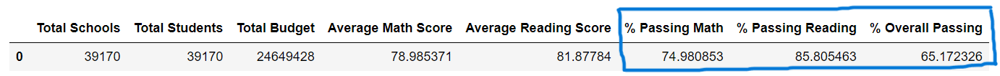
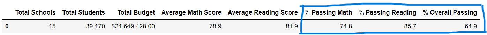
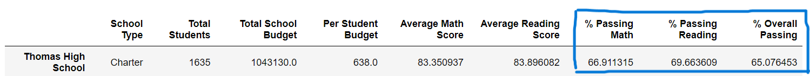
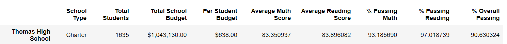

# PyCitySchools_Challenge

# Overview of the school district analysis
We have data from the school district with students' names, their math scores, reading scores, which schools they go to and, which district those schools are in, and etc. 
It's much of information and we are tring to clean up some of the areas in the data and figure out what the data is telling us; 
how different the math and reading scores are by school, how much money the schools are spending, how that is related to the students' scores and, 
which grade is doing better for each school. 

# Results

### How is the district summary affected?

As you can see the screenshot above which is the original district summary data frame, Passing Math Percentage is 75.0% and Passing Reading Percentage is 85.8%, 
and the Overall Passing Percentage is 65.2%. 

What we have changed here was the student count: The original district summary data was with the total number of students, but here we subtracted the number of students 
that are in ninth grade at Thomas High School from the total student count to get the new total student count. 
So, the new total student count was reflected into our passing math, reading, and overall percentages. 

% of Passing Math: 75.0% -> 74.8%
% of Passing Reading: 85.8% -> 85.7%
% of Passing Overall: 65.2% -> 64.9%

The percentages all went down, but not by much. My conclusion is that the district summary data with the new student count affected our original data by going down, 
which means that the passing students from the 9th graders at Thomas high school actually was helping the whole district passing percentages. 

### How is the school summary affected?

As you can see the screenshot above, the original per school summary data frame,  

### How does replacing the ninth graders’ math and reading scores affect Thomas High School’s performance relative to the other schools?

### How does replacing the ninth-grade scores affect the following:
#### Math and reading scores by grade

#### Scores by school spending

#### Scores by school size

#### Scores by school type
