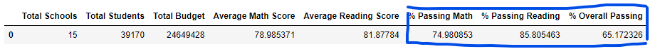

# PyCitySchools_Challenge

# Overview of the school district analysis
We have data from the school district with students' names, their math scores, reading scores, which schools they go to and, which district those schools are in, and etc. 
It's much of information and we are tring to clean up some of the areas in the data and figure out what the data is telling us; 
how different the math and reading scores are by school, how much money the schools are spending, how that is related to the students' scores and, 
which grade is doing better for each school. 

# Results

## How is the district summary affected?

The original data was after we replaced the 9th grade reading and math scores at Thomas High School with NaN.
This is the result from the original district summary data, and the passing Math percentage was 75.0% and Passing Reading Percentage was 85.8%, 
and the Overall Passing Percentage was 65.2%. 

What we have changed here was the student count: The number of students that are in ninth grade at Thomas High School who had no grades was 461. And here we subtracted 
461 from the total student count to get the new total student count, which results in having 38709, new student count. 
So, the new total student (without 9th graders' scores) count was reflected into our passing math, reading, and overall percentages. 
The percentages all went down, but not by much.

% of Passing Math: 75.0% -> 74.8%  //
% of Passing Reading: 85.8% -> 85.7%  //
% of Passing Overall: 65.2% -> 64.9%

It shows that cleaning the 9th graders that had no grades did not affect the district summary much, but by removing them, the percentages went down.

## How is the school summary affected?

As you can see the screenshot above, the original per school summary data frame, passing math percentage was 66.9%, passing reading percentage was 69.7%, and
the overall passing percentage was 65.1%. (The original school summary had all graders including 9th graders that had no grades.)

Summary: Summarize four changes in the updated school district analysis after reading and math scores for the ninth grade at Thomas High School have been replaced with NaNs.

We replaced the Thomas High School graders' numbers to only 10th to 12th graders at Thomas High School. 
So, the new grader group which became our numerator in the percentage calculation and our passing math, reading, and overall percentages went up! 

% of Passing Math: 66.9% -> 93.2%  //
% of Passing Reading: 69.7% -> 97.0%  //
% of Passing Overall: 65.1% -> 90.6%

## How does replacing the ninth graders’ math and reading scores affect Thomas High School’s performance relative to the other schools?
Replacing the ninth graders' math and reading scores definitely affected Thomas High School's performance by a lot.
Their overall passing percentage was 65.1% which was really low and it went up to 90.6%, then they got into the top 5 schools. 

## How does replacing the ninth-grade scores affect the following:

### Math and reading scores by grade
Before we replaced the ninth-grade scores to NaN, the average Math score from 9th graders was 83.6 and the average reading score was 83.7.
But now we see NaN for the ninth graders for Thomas High School as you can see in the data frames below, after replacing.

### Scores by school spending
Thomas High School falls in the $630-$644 per student spending range, but there was not much of change in the scores. 
As you can see below, if we really want to see the difference, we need to look at the hundreths place of the decimals.

### Scores by school size
Thomas High School falls in Medium (1000-2000) range, and you cannot really tell the change from the original. 

### Scores by school type
Thomas High School is in Charter school type and like the previous comparisons, we cannot see the nominal changes in scores. 

# Summary: 
## Summarize four changes in the updated school district analysis after reading and math scores for the ninth grade at Thomas High School have been replaced with NaNs.
1. The overall passing percentage was dramaticallly changed from 65% to 90%.
2. Thomas High School's performance was dramatically changed from the top 3 bottom to the top 2!
3. Data that we have now will show NaN for the 9th graders' scores at Thomas High School.
4. Replacing the 9th-grade scores had very little impact on the scores by grade data,  the scores by school spending data, the scores by school size data, 
   and scores by school type data.
5. In addition to the dramatic change in the overall passing percentages, we can see some changes in the average scores.
